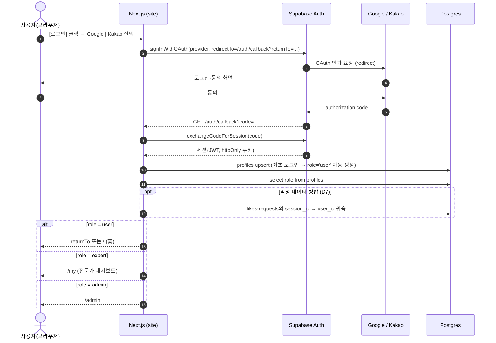
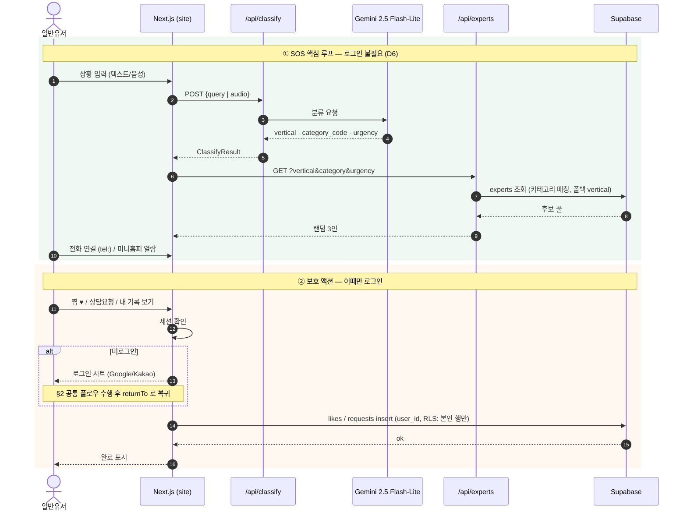
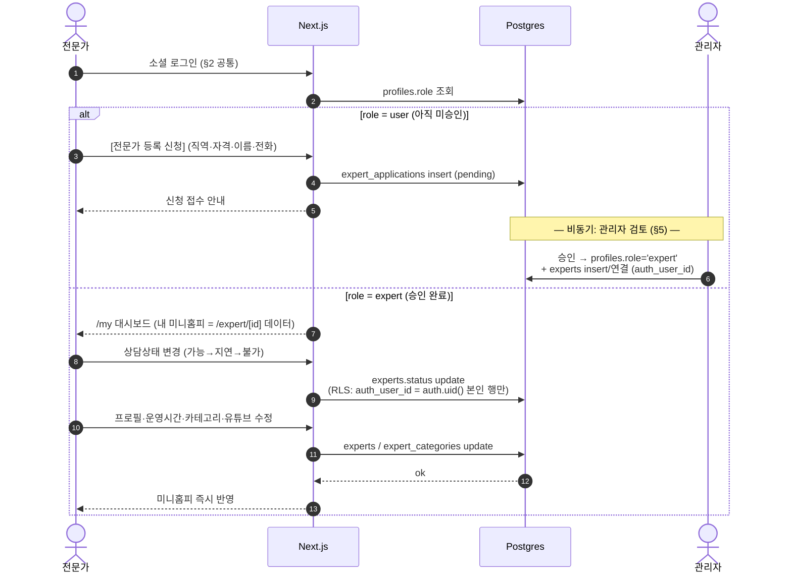
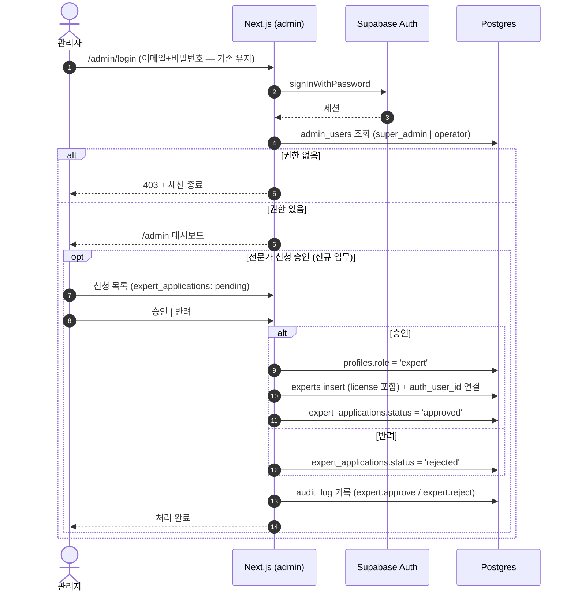

# 설계: 소셜 로그인 + 3역할 인증 (일반유저·전문가·관리자)

> 상태: 설계 (구현 전) · 작성 2026-06-13
> 관련: [golgoru-sos.plan.md](../../01-plan/features/golgoru-sos.plan.md), [admin-dashboard.plan.md](../../01-plan/features/admin-dashboard.plan.md), [experts-schema.design.md](experts-schema.design.md)

## 1. 설계 결정 요약

| # | 결정 | 근거 |
|---|---|---|
| D1 | 인증은 **Supabase Auth OAuth** (Google·Kakao 공식 provider 지원) | 이미 Supabase 스택, 별도 인증 서버 불필요 |
| D2 | 역할은 **`profiles` 테이블 1곳에서 관리** — `role: 'user' \| 'expert' \| 'admin'` | 역할 분기 단일 출처. JWT custom claim 은 Post-MVP |
| D3 | **최초 소셜 로그인 = 자동 `user` 가입** (profiles 자동 생성) | 가입 마찰 제로. 전문가·관리자는 승격 방식 |
| D4 | **전문가 = 신청 → 관리자 승인 → `role='expert'` + `experts.auth_user_id` 연결** | 자격 검증 필요 직군. 셀프 승격 차단 |
| D5 | **관리자 로그인은 기존 이메일+비밀번호 유지** (`/admin/login` + `admin_users`) | 이미 구현·감사로그 연동 완료. 소셜 전환 실익 없음 |
| D6 | 소비자 SOS 핵심 루프(입력→추천→전화)는 **비로그인 그대로** | "30초 안에 연결" 원칙. 로그인은 찜·상담요청 등 보호 액션에서만 요구 |
| D7 | 기존 익명 `session_id`(likes/requests)는 로그인 시 `user_id` 로 **병합(claim)** | 비로그인→로그인 전환 시 데이터 연속성 |

### 스키마 변경 (구현 시)

```sql
-- 역할 단일 출처
create table profiles (
  id uuid primary key references auth.users on delete cascade,
  role text not null default 'user' check (role in ('user','expert','admin')),
  display_name text,
  created_at timestamptz default now()
);
-- 전문가 계정 연결 (관리자 승인 시 set)
alter table experts add column auth_user_id uuid references auth.users;
-- 전문가 등록 신청
create table expert_applications (
  id uuid primary key default gen_random_uuid(),
  user_id uuid not null references auth.users,
  vertical text not null, license text, name text, phone text,
  status text not null default 'pending' check (status in ('pending','approved','rejected')),
  created_at timestamptz default now()
);
```

---

## 2. 공통: 소셜 로그인 + 역할 라우팅

모든 역할이 공유하는 진입 플로우. 로그인 완료 후 `profiles.role` 로 목적지를 분기한다.



---

## 3. 일반유저: SOS 루프 (비로그인) + 보호 액션 (로그인 요구)

핵심 루프는 기존 그대로 무인증. 로그인은 **보호 액션 시점에만** 끼어든다 (lazy auth).



---

## 4. 전문가: 등록 신청 → 승인 → 미니홈피 셀프 관리

전문가는 일반유저로 가입한 뒤 **신청·승인**을 거쳐 승격된다 (D4). 승인 후엔 본인 미니홈피(상담상태·운영시간·프로필)를 직접 관리한다.



---

## 5. 관리자: 기존 이메일 로그인 유지 + 전문가 승인 추가

기존 구현(`/admin/login` → `admin_users` 권한 확인 → `audit_log`)을 그대로 두고, **전문가 신청 승인** 업무만 추가된다 (D5).



---

## 6. 역할 × 접근 매트릭스

| 경로 | 비로그인 | user | expert | admin |
|---|---|---|---|---|
| `/` SOS 입력 → `/result` 추천 → 전화 | ✅ | ✅ | ✅ | ✅ |
| `/experts` 둘러보기 · `/expert/[id]` 미니홈피 열람 | ✅ | ✅ | ✅ | ✅ |
| 찜 ♥ · 상담요청 · 내 기록 | 로그인 유도 | ✅ | ✅ | ✅ |
| `/my` 내 미니홈피 관리 (상태·프로필) | ✖ | 신청 화면 | ✅ 본인 행만 | ✖ |
| `/admin` 전체 관리 | ✖ | ✖ | ✖ | ✅ |

## 7. 구현 시 체크리스트 (Post-설계)

- [ ] Supabase Dashboard: Google·Kakao provider 활성화 (Kakao는 카카오디벨로퍼스 앱 + Redirect URI 등록)
- [ ] `profiles`·`expert_applications` 테이블 + RLS (`profiles`: 본인 조회, `experts`: `auth_user_id` 본인 update)
- [ ] `/auth/callback` 라우트 핸들러 (`exchangeCodeForSession` + role 분기 + session_id 병합)
- [ ] 로그인 시트 컴포넌트 (보호 액션 진입점 공용, returnTo 보존)
- [ ] `/my` 전문가 대시보드 (미니홈피 데이터 재사용 — `/expert/[id]` 컴포넌트 공유)
- [ ] 어드민 전문가 신청 승인 화면 + `expert.approve/reject` AuditAction
- [ ] 메인 헤더 `유` 아바타 → 로그인 상태 표시·메뉴로 교체
