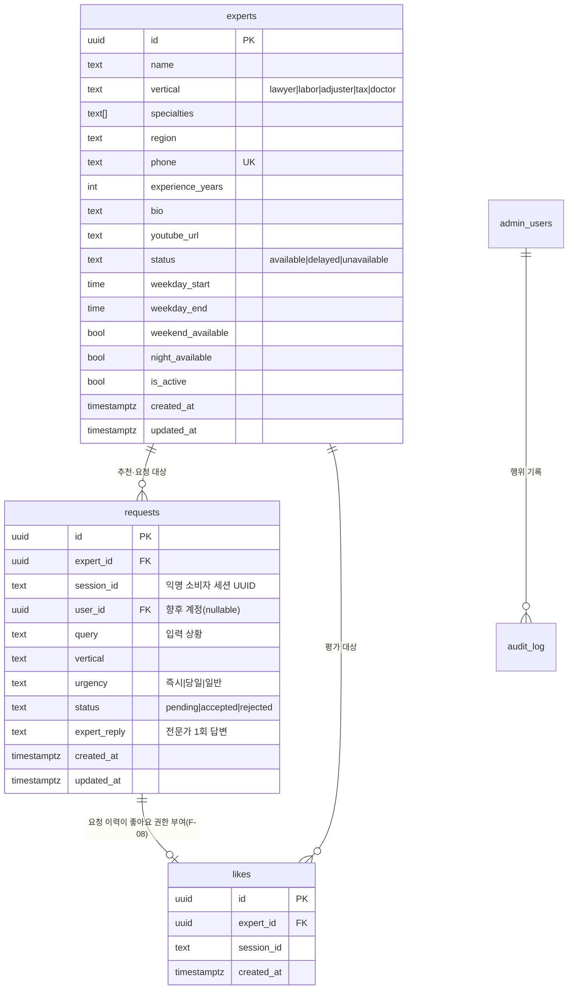

# experts-schema Design Document (UI→엔티티 정합 + 핵심 루프 스키마)

> **Summary**: 실 Supabase 전환 후 드러난 "UI 요구 필드 ↔ DB 스키마" 불일치를 해소한다. UI가 렌더하는 전문가 필드를 엔티티로 정리하고, 전략 정합 결정(별점 제거·상담건수 숨김·3단계 상태+운영시간 도입)을 반영한 **experts v2** 스키마와, MVP 핵심 루프의 빠진 엔티티 **requests / likes** 를 설계한다.
>
> **Status**: Draft (구현 대기)
> **상위 맥락**: [golgoru-sos.plan.md](../../01-plan/features/golgoru-sos.plan.md) F-03/F-05/F-07/F-08, [admin-dashboard.plan.md](../../01-plan/features/admin-dashboard.plan.md) §6.5
> **결정 근거**: 2026-06-09 사용자 확정 (§2)

---

## 1. UI → 필드 인벤토리 (코드 기준)

4개 화면이 실제로 읽는 전문가 필드와 현재 DB([supabase-setup.sql](../../../supabase-setup.sql)) 커버 여부:

| 필드 | 카드 | 상세 | 결과 | 어드민폼/CSV | DB 컬럼 | 판정 |
|---|:--:|:--:|:--:|:--:|:--:|---|
| name, vertical, specialties, region, phone, experience_years | ● | ● | ● | ● | ✅ | OK |
| bio, youtube_url | | ● | | ● | ✅ | OK |
| `is_available` (통화가능 배지) | ● | ● | ● | ● | ✅(boolean) | → **status로 승격** |
| `rating` (별점 ⭐) | ● | | | | ❌ | **제거**(전략) |
| `case_count` (상담 N건) | ● | | | | ❌ | **숨김**(MVP) |
| 운영시간(평일/주말/야간) | | | | (계획에만) | ❌ | **신규 추가** |
| 3단계 상태 | | | | (계획에만) | ❌ | **신규 추가** |

> 근거: [ExpertCard.tsx](../../../components/ExpertCard.tsx) (rating L36·case_count L68·is_available L55), [expert/[id]/page.tsx](../../../app/(site)/expert/[id]/page.tsx), [types.ts](../../../lib/types.ts), [csv.ts](../../../lib/admin/csv.ts).

## 2. 확정 결정 (2026-06-09)

| # | 결정 | 영향 |
|---|---|---|
| D1 | **별점(rating) UI 제거** — DB 컬럼 없음 | 전략(별점 out of scope, [[expert-recommendation-random]]) 정합. 카드/상세에서 별점 제거 |
| D2 | **상담건수(case_count) MVP 숨김** — DB 컬럼 없음 | UI 제거. 후일 `requests` 누적 시 `count()` 파생으로 부활 |
| D3 | **상태=3단계 + 운영시간 도입** | `is_available`(boolean) → `status` enum + 운영시간 컬럼. 계획 §6.5/CSV 설계와 일치 |

## 3. 타깃 ERD (MVP 핵심 루프)



기존 `admin_users`, `audit_log`([supabase-admin-setup.sql](../../../supabase-admin-setup.sql))는 변경 없음.

## 4. experts v2 — 스키마 변경

**추가 컬럼**

| 컬럼 | 타입 | 제약 | 의미 |
|---|---|---|---|
| `status` | text | not null default `'available'`, check in (available\|delayed\|unavailable) | 3단계 상담 상태 |
| `weekday_start` | time | nullable | 평일 운영 시작 (HH:mm) |
| `weekday_end` | time | nullable | 평일 운영 종료 |
| `weekend_available` | boolean | not null default false | 주말 상담 가능 |
| `night_available` | boolean | not null default false | 야간 상담 가능 |

**마이그레이션 원칙**
- `status` 백필: 기존 `is_available=true → 'available'`, `false → 'delayed'`.
- `is_available`은 **코드 전환 전까지 유지**(SELECT/UI/CSV가 아직 참조). 코드 전환 후 별도 단계에서 drop (§6 체크리스트).
- 추천 로직(`urgency==='즉시'`)의 정렬 키: `is_available` → `status='available'` 우선으로 교체.

## 5. requests / likes — 신규 엔티티

### 5.1 requests (F-05 핵심 루프 — 현재 미존재 = MVP 심장 공백)
- 익명 소비자도 요청 가능해야 하므로 `session_id`(클라 생성 UUID) 기반. `user_id`는 향후 계정용 nullable.
- 상태 흐름: `pending`(생성) → 전문가가 `accepted`/`rejected` + `expert_reply` 1회.
- RLS: insert는 누구나(공개), select/update는 (a) 해당 전문가 본인 또는 (b) 서버 service role. 어드민 모니터링(FR-07)은 service role.

### 5.2 likes (F-08)
- 중복 방지: `unique(expert_id, session_id)`.
- **비즈니스 규칙**: "실제 상담 요청 이력이 있는 세션만 좋아요" → `requests`에 동일 `session_id`+`expert_id` 행 존재를 **서버 로직에서 검증**(순수 RLS로는 표현 복잡, MVP는 서버 가드).

## 6. 코드 변경 체크리스트 (스키마와 동시 반영)

- [x] [supabase-schema-v2.sql](../../../supabase-schema-v2.sql) 실행 (experts ALTER + requests/likes CREATE) — 2026-06-09 Success
- [x] [types.ts](../../../lib/types.ts): `Expert`에서 `rating?`·`case_count?` 제거, `status`·운영시간 추가. `ConsultRequest`·`Like` 타입 신설
- [x] [supabase-repository.ts](../../../lib/experts/supabase-repository.ts): `SELECT`에 status·운영시간 추가, `is_available` 정렬 → `status` 필터
- [x] [mock-repository.ts](../../../lib/experts/mock-repository.ts): `is_available`→`status==='available'`
- [x] [ExpertCard.tsx](../../../components/ExpertCard.tsx): 별점·상담건수 제거, 배지 `STATUS_LABEL[status]` 3단계
- [x] [expert/[id]/page.tsx](../../../app/(site)/expert/[id]/page.tsx): `is_available`→`status` + "상담 가능 시간" 섹션 추가
- [x] [constants.ts](../../../lib/constants.ts): `STATUS_LABEL` 추가
- [x] [csv.ts](../../../lib/admin/csv.ts): `CSV_HEADERS`에 status·운영시간 추가(§6.5 정합), 검증 스키마·템플릿 갱신, Y/N 허용
- [x] [admin/types.ts](../../../lib/admin/types.ts) · [ExpertForm.tsx](../../../components/admin/ExpertForm.tsx): `ExpertInput` + 폼(상태 select·운영시간 입력)
- [x] [admin/experts/route.ts](../../../app/api/admin/experts/route.ts) · [[id]/route.ts](../../../app/api/admin/experts/[id]/route.ts): SELECT·insert·patch 갱신
- [x] [mock-data.ts](../../../lib/mock-data.ts): rating/case_count 제거, status·운영시간 채움
- [x] 타입검사(tsc --noEmit) 0 에러 · 잔여 `is_available`/`rating`/`case_count` 참조 0
- [ ] **(남은 1단계) experts.`is_available` drop** — 코드가 더 이상 참조 안 함. SQL Editor에서 실행 가능:

  ```sql
  alter table experts drop column is_available;
  ```

## 7. Out of Scope
- `problems`/`matches` 데이터 플라이휠 (전략 Phase 2)
- 별점·상담건수 부활 (D1/D2 — 좋아요/요청 누적 후 재검토)
- 운영시간 기반 자동 status 토글(스케줄러) — 현재는 수동 status

## Version History
| Version | Date | Changes | Author |
|---|---|---|---|
| 1.0 | 2026-06-09 | 초안 — UI 갭 분석 + experts v2 + requests/likes 설계, D1~D3 반영 | Kim KJ |
