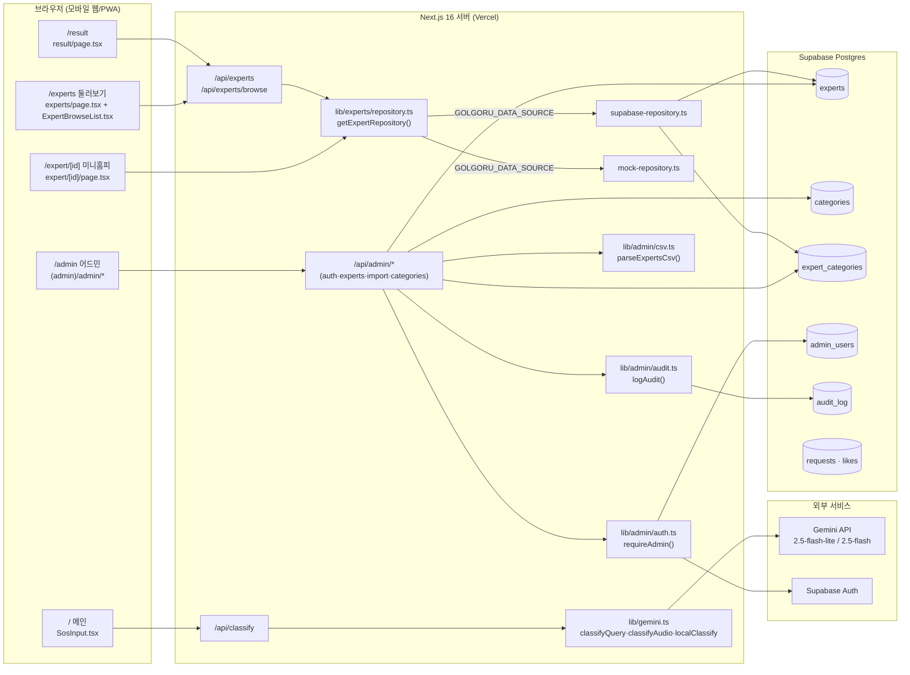
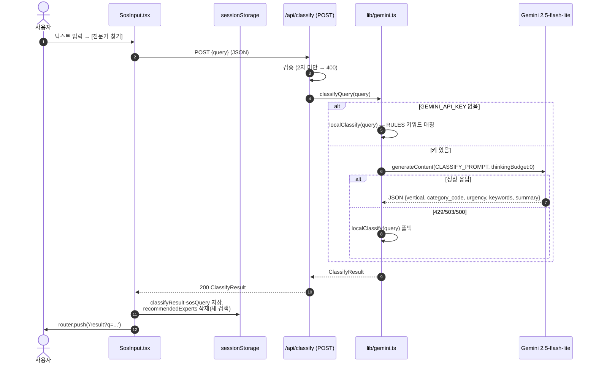
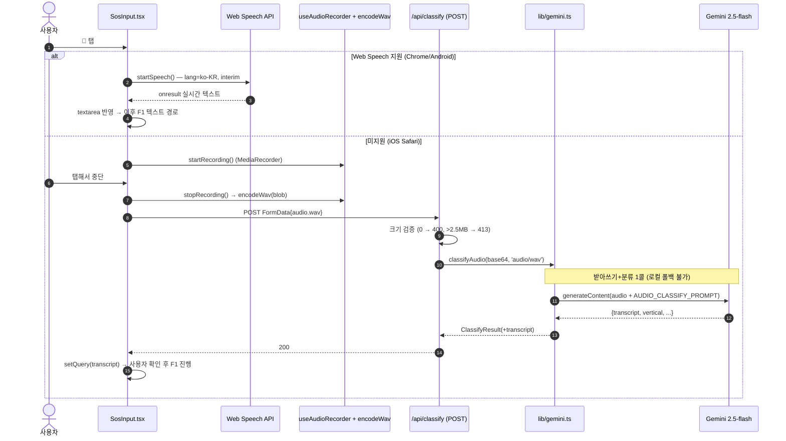
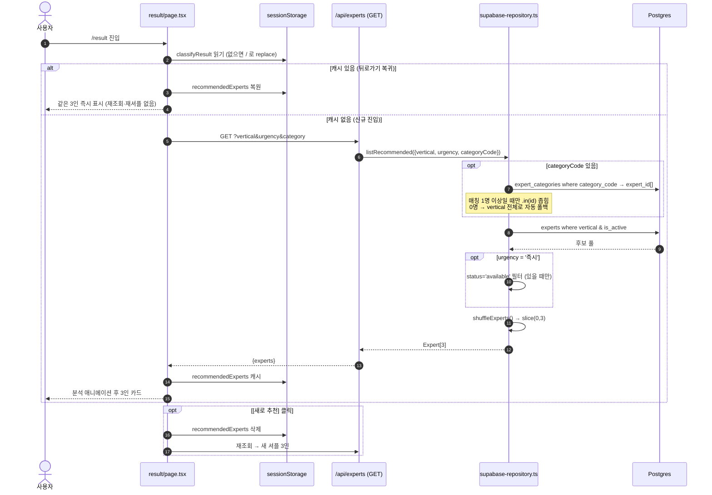
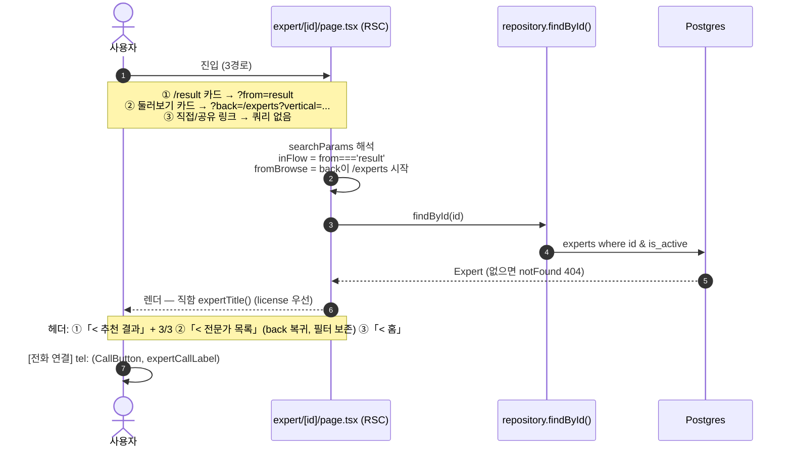
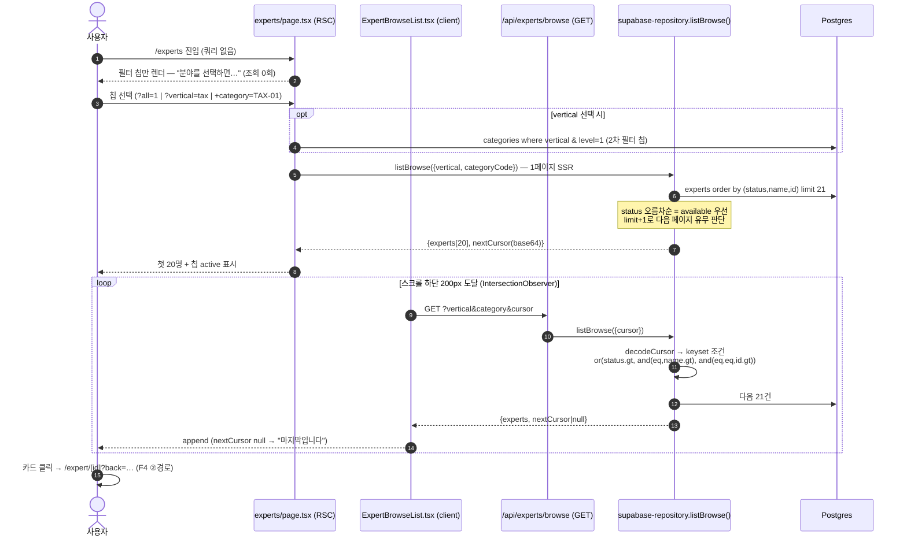
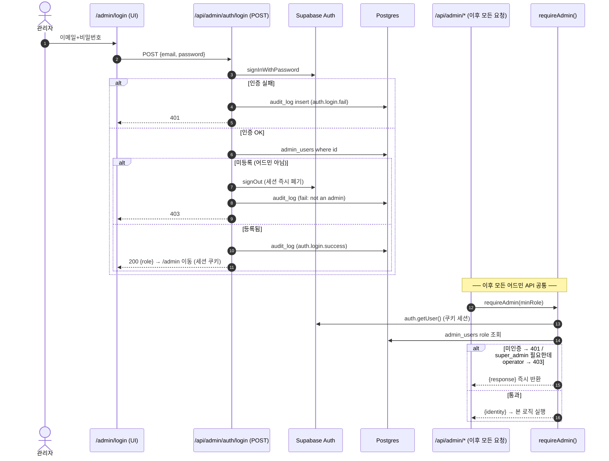
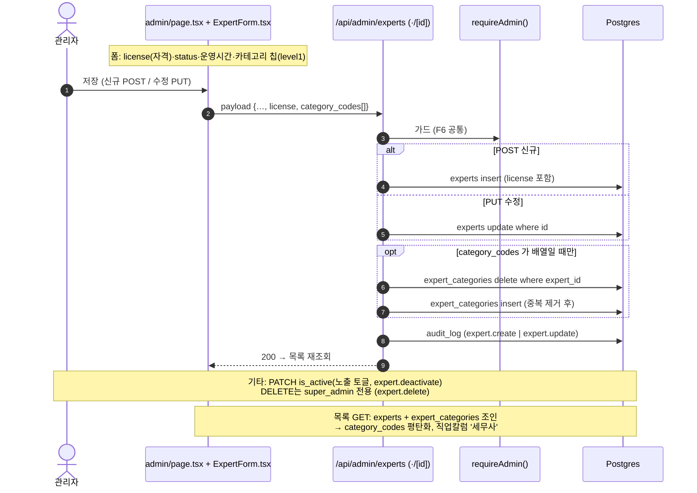
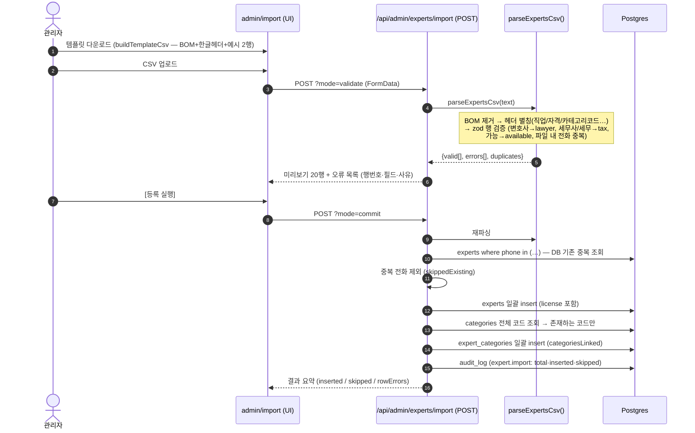
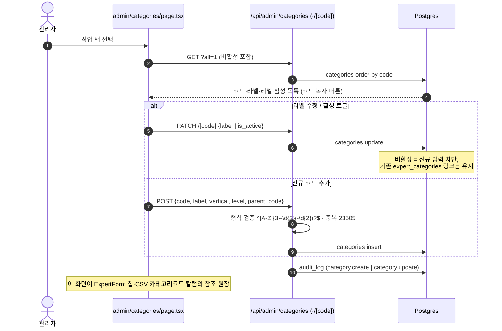

# golgoru-sos 전체 시스템 시퀀스 다이어그램

> 작성 2026-06-13 · 기준 커밋 `779b616` (세무사 단일화 반영)
> 목적: **유지보수 및 개발자 미션별 업무 분해**의 기준 문서. 각 기능이 어느 모듈·함수·테이블을 거치는지 추적 가능하게 한다.

## 0. 단위 선택 기준

| 축 | 선택 단위 | 표기 방식 |
|---|---|---|
| 다이어그램 분리 | **임무(기능) 단위** — F1~F9 + 예정 1건 | 기능당 다이어그램 1개 |
| 참여자(participant) | **모듈 단위** — 컴포넌트 / API 라우트 / lib 모듈 / 외부 서비스 / DB | 파일 경로 명시 |
| 메시지(화살표) | **함수·엔드포인트 단위** | `함수명()` / `METHOD /경로` 표기 |
| DB | **테이블 단위** | 메시지에 테이블·연산 명시 |

> 읽는 법: 다이어그램의 화살표 라벨에 있는 함수명을 그대로 grep 하면 코드 위치가 나온다. §12의 모듈-파일 매핑과 함께 사용.

---

## 1. 시스템 컨텍스트 (모듈 지도)

---

## 2. F1 — SOS 텍스트 분류 (입력 → 분야·카테고리·긴급도)

핵심 설계: **Gemini 우선, 장애 시 로컬 키워드 룰 폴백** — 분류는 절대 죽지 않는다.

**오류 경로**: 분류 실패(throw) → 500 → SosInput이 "잠시 후 다시 시도해주세요" 표시.

---

## 3. F2 — 음성 입력 (브라우저별 이중 경로)

**오류 경로**: 키 없음 → `GeminiConfigError` → 503 "텍스트로 입력해주세요" / 무음 → 422 "다시 시도".

---

## 4. F3 — 전문가 3인 랜덤 추천 (+ 캐시·재추천)

핵심 설계: **카테고리 코드 우선 매칭 → 0명이면 vertical 폴백 → 셔플 3인**. 뒤로가기는 캐시 복원(같은 3인), "새로 추천"만 재셔플.

---

## 5. F4 — 미니홈피 (`/expert/[id]`) 진입 맥락 분기

한 페이지가 3가지 진입 맥락을 처리한다. 뒤로가기 라벨 = **돌아갈 목적지**.

---

## 6. F5 — 전문가 둘러보기 (필터 + 커서 무한 스크롤)

핵심 설계: **선택 전 조회 없음 → 첫 페이지 SSR → 하단 도달 시 커서 append**. 정렬은 중립 키 — 디렉터리에 서열 의미 부여 금지.

---

## 7. F6 — 어드민 로그인 + API 가드 (공통 관문)

모든 `/api/admin/*` 요청은 `requireAdmin()`을 통과한다. 실패 양상까지 감사로그에 남는다.

---

## 8. F7 — 전문가 CRUD + 카테고리 동기화 (어드민)

핵심 설계: `experts` 본체와 `expert_categories` 링크는 **전삭제-재삽입(syncCategories)** 으로 동기화. 모든 변이는 감사로그.

---

## 9. F8 — CSV 일괄 등록 (validate → commit 2단계)

핵심 설계: **검증과 반영 분리**. 한글 헤더/값 별칭 흡수, 부분 성공 허용(중복 전화는 건너뜀).

---

## 10. F9 — 카테고리 관리 (어드민)

---

## 11. (예정) F10 — 소셜 로그인 · 3역할

일반유저·전문가·관리자 역할 분리와 Google/Kakao OAuth 플로우는 별도 설계 문서 참조:
→ **[auth-social-login.design.md](features/auth-social-login.design.md)** (§2 공통 로그인, §3 보호 액션, §4 전문가 승인, §5 관리자)

---

## 12. 모듈-파일 매핑 (미션별 업무 분해 기준표)

| 기능 | 화면(클라이언트) | API 라우트 | 핵심 로직(lib) | DB 테이블 |
|---|---|---|---|---|
| F1 텍스트 분류 | `components/SosInput.tsx` | `app/api/classify/route.ts` | `lib/gemini.ts` (classifyQuery·localClassify·RULES) | — |
| F2 음성 입력 | `components/SosInput.tsx` | 〃 | `lib/gemini.ts` (classifyAudio), `lib/audio/*` | — |
| F3 3인 추천 | `app/(site)/result/page.tsx` | `app/api/experts/route.ts` | `lib/experts/*-repository.ts` (listRecommended) | experts, expert_categories |
| F4 미니홈피 | `app/(site)/expert/[id]/page.tsx`, `CallButton.tsx` | — (RSC 직접 조회) | repository (findById), `lib/constants.ts` (expertTitle) | experts |
| F5 둘러보기 | `app/(site)/experts/page.tsx`, `ExpertBrowseList.tsx`, `ExpertCard.tsx` | `app/api/experts/browse/route.ts` | repository (listBrowse, 커서 인코딩) | experts, expert_categories, categories |
| F6 어드민 인증 | `app/(admin)/admin/login/*` | `app/api/admin/auth/*` | `lib/admin/auth.ts` (requireAdmin), `supabaseServer.ts` | admin_users, audit_log |
| F7 전문가 CRUD | `app/(admin)/admin/page.tsx`, `ExpertForm.tsx` | `app/api/admin/experts/route.ts`, `[id]/route.ts` | `lib/admin/audit.ts` | experts, expert_categories, audit_log |
| F8 CSV 등록 | `app/(admin)/admin/import/*` | `app/api/admin/experts/import/route.ts`, `template/route.ts` | `lib/admin/csv.ts` | experts, expert_categories, categories, audit_log |
| F9 카테고리 | `app/(admin)/admin/categories/page.tsx` | `app/api/admin/categories/*` | — | categories, audit_log |
| 공통 | `lib/tokens.ts`(디자인), `lib/constants.ts`(라벨) | — | `lib/types.ts`, `lib/supabase.ts`, `lib/experts/data-source.ts` | — |

### 미션 분해 가이드

- **소비자 UI 미션** → F1~F5 행의 화면 칼럼만. API 계약(`ClassifyResult`, `{experts, nextCursor}`)이 경계.
- **추천·검색 로직 미션** → repository 칼럼만. `ExpertRepository` 인터페이스가 경계 — mock/supabase 동시 수정 필수.
- **어드민 미션** → F6~F9. 모든 변이에 `requireAdmin` 가드 + `logAudit` 호출이 규약.
- **분류 품질 미션** → `lib/gemini.ts` 단독 (CLASSIFY_PROMPT·CATEGORY_GUIDE·RULES). 카테고리 추가 시 F9 화면과 `CATEGORY_GUIDE` 동기화 필요.
- **스키마 미션** → 루트 `supabase-*.sql` + `lib/types.ts` + SELECT 상수 3곳(공개 repo·admin 2 라우트) 동시 변경 — license 추가 때와 동일 패턴.
