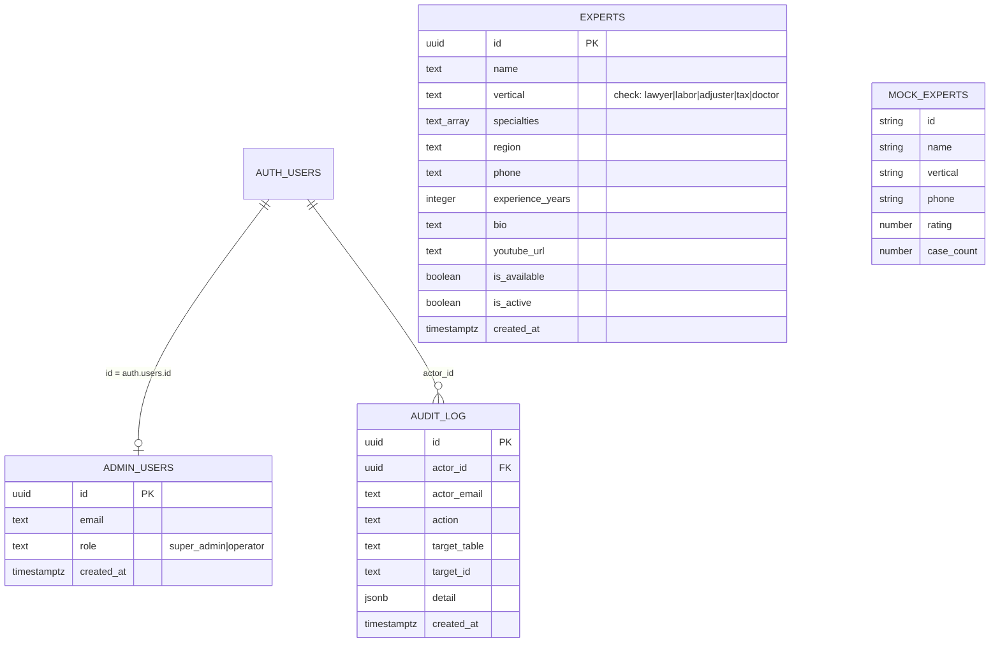
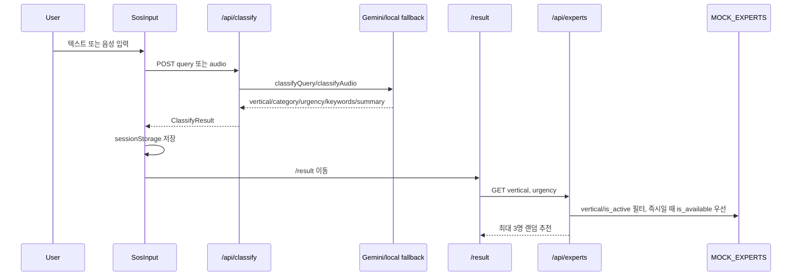
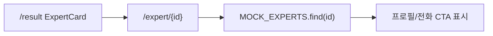
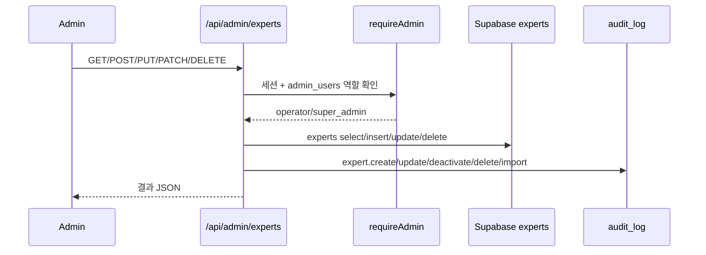
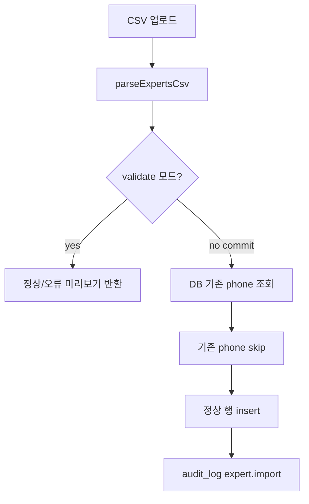
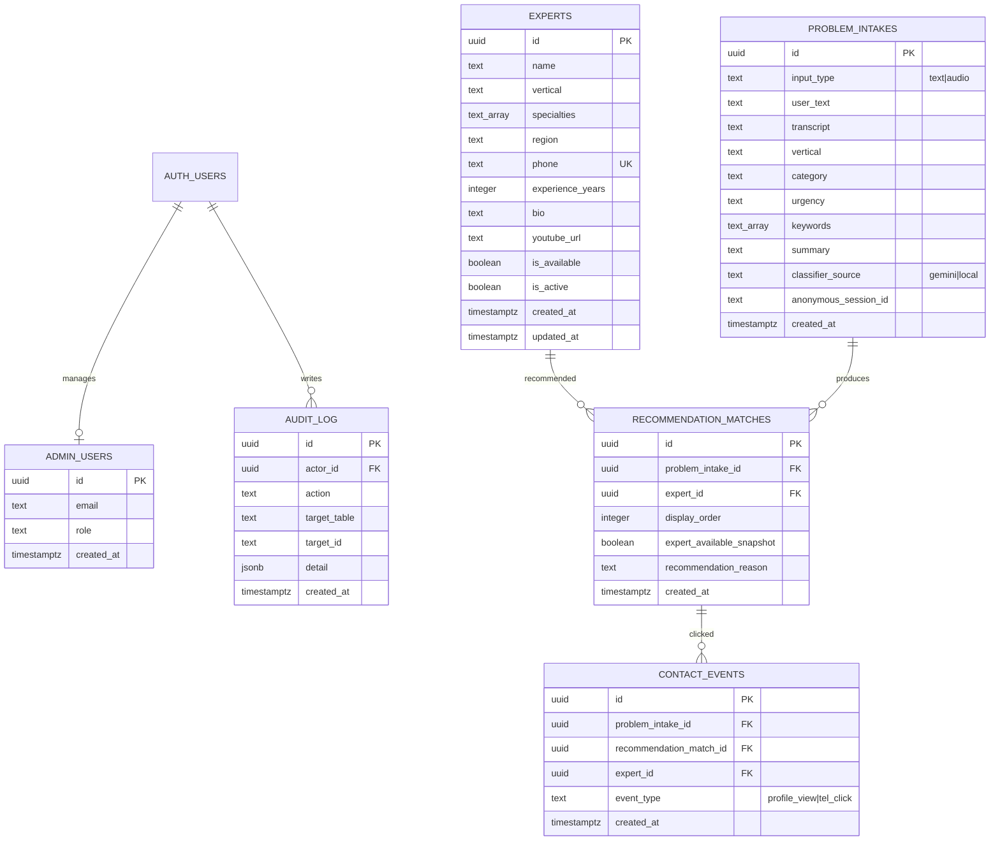

# golgoru-sos 데이터 흐름·ERD·무결성 점검

> 목적: 히어로/화면 디자인은 고정된 것으로 보고, 현재 웹앱이 서비스 제공에 필요한 데이터를 일관되게 저장·조회·검증하는지 점검한다.
> 범위: 소비자 SOS 플로우, 공개 전문가 추천 API, 전문가 상세, 어드민 CRUD/CSV, Supabase 스키마, 감사 로그.

## 1. 결론

현재 구현은 **디자인 확정 전 MVP 프로토타입 관점에서는 동작 가능**하지만, **서비스 제공 관점의 데이터 흐름은 아직 단절되어 있다.**

핵심 이유는 하나다. 어드민은 Supabase `experts` 테이블을 쓰지만, 소비자 추천·상세 화면은 여전히 `MOCK_EXPERTS`를 사용한다. 따라서 운영자가 어드민에서 전문가를 등록·수정·비활성화해도 실제 사용자가 보는 추천 결과에는 반영되지 않는다.

데이터베이스 관점에서도 `experts`, `admin_users`, `audit_log`만 존재한다. 사용자가 어떤 문제를 입력했는지, 어떤 전문가가 추천됐는지, 어떤 전화 연결이 발생했는지는 저장되지 않는다. 이 상태에서는 서비스 품질 측정, 추천 개선, 운영 감사, 전환율 분석이 불가능하다.

우선순위는 다음이다.

1. 공개 추천 API와 전문가 상세를 Supabase `experts`로 전환한다.
2. `problem_intakes`, `recommendation_matches`, `contact_events` 개념을 추가해 사용자 문제·추천·전화 클릭을 저장한다.
3. 전문가 데이터의 DB 제약과 서버 검증을 강화한다.
4. AI 분류 결과를 런타임 스키마로 검증해 잘못된 `vertical`/`urgency`가 추천 단계로 넘어가지 않게 한다.

## 2. 근거 파일

| 영역 | 파일 |
|---|---|
| DB 스키마 | `supabase-setup.sql`, `supabase-admin-setup.sql` |
| 공개 추천 API | `app/api/experts/route.ts` |
| 전문가 상세 | `app/(site)/expert/[id]/page.tsx` |
| 결과 화면 | `app/(site)/result/page.tsx` |
| AI 분류 | `app/api/classify/route.ts`, `lib/gemini.ts` |
| 어드민 CRUD | `app/api/admin/experts/route.ts`, `app/api/admin/experts/[id]/route.ts` |
| CSV | `app/api/admin/experts/import/route.ts`, `lib/admin/csv.ts` |
| 인증·감사 | `lib/admin/auth.ts`, `lib/admin/audit.ts`, `app/api/admin/auth/login/route.ts` |

## 3. 현재 ERD(as-built)



주의: `MOCK_EXPERTS`는 DB 엔티티가 아니라 코드 상수다. 그러나 현재 공개 추천과 전문가 상세가 이 상수를 사용하므로, 실제 서비스 데이터 흐름상 독립 저장소처럼 동작한다.

## 4. 현재 데이터 흐름

### 4.1 소비자 SOS 입력 → 추천



관찰:
- `ClassifyResult`와 원문은 `sessionStorage`에만 저장된다.
- `/api/experts`는 Supabase가 아니라 `MOCK_EXPERTS`를 사용한다.
- 추천 결과 자체도 DB에 저장되지 않는다.
- 전화 클릭, 프로필 조회, 실제 연결 성공 여부도 저장되지 않는다.

### 4.2 전문가 상세



관찰:
- 상세 페이지도 `MOCK_EXPERTS`만 조회한다.
- 공개 API를 Supabase로 전환하더라도 상세가 그대로면, UUID 기반 DB 전문가 상세는 404가 된다.

### 4.3 어드민 전문가 관리



관찰:
- 어드민은 Supabase `experts`를 사용한다.
- 삭제는 `super_admin`만 허용된다.
- 생성·수정·삭제·CSV import는 감사 로그 호출이 있다.
- 그러나 이 DB 데이터가 소비자 화면으로 이어지지 않는다.

### 4.4 CSV import



관찰:
- CSV는 가장 강한 검증을 수행한다.
- 파일 내 phone 중복과 DB 기존 phone 중복을 처리한다.
- 하지만 DB 자체에 phone unique 제약이 없어서 단건 생성/수정 경로에서는 중복을 막지 못한다.

## 5. 무결성 점검

### 5.1 잘 되어 있는 부분

| 항목 | 판정 | 근거 |
|---|---:|---|
| `vertical` 도메인 정의 | 양호 | DB check constraint와 TS `Vertical`이 같은 5개 값을 사용한다. |
| 공개 RLS 원칙 | 양호 | `experts`는 `is_active = true` 공개 select 정책이 있다. |
| 어드민 인증 경계 | 양호 | `proxy.ts`와 `requireAdmin`으로 `/admin`, `/api/admin` 접근을 막는다. |
| CSV 데이터 품질 | 양호 | enum, phone 형식, 경력 범위, URL, bool 기본값, 중복 phone을 검증한다. |
| 감사 로그 개념 | 부분 양호 | 주요 어드민 쓰기와 로그인 성공/실패에 audit 호출이 있다. |
| 랜덤 추천 원칙 | 양호 | 공개 추천 API는 후보 풀에서 랜덤 셔플 후 3명을 노출한다. |

### 5.2 주요 리스크

#### R1. 공개 서비스 데이터와 어드민 DB가 단절됨

심각도: Critical

`/api/experts`와 `/expert/[id]`가 `MOCK_EXPERTS`를 사용한다. 어드민이 Supabase에 전문가를 등록해도 소비자 추천에는 반영되지 않는다.

영향:
- 운영자가 관리하는 실제 전문가 풀과 사용자 노출 결과가 다르다.
- 비활성화·전화번호 변경·지역 변경이 서비스에 반영되지 않는다.
- 어드민 기능의 서비스 가치가 현재는 내부 목록 관리에 그친다.

권장:
- `/api/experts`를 Supabase `experts` 조회로 전환한다.
- `/expert/[id]`도 Supabase `experts.id` 기준 상세 조회로 전환한다.
- 소비자 조회는 anon/RLS 또는 서버용 공개 repository 중 하나로 일관화한다.

#### R2. 문제 입력과 추천 결과가 저장되지 않음

심각도: Critical

현재 사용자의 원문, AI 분류 결과, 추천된 전문가 목록, 전화 클릭은 모두 휘발성이다.

영향:
- 전환율: 입력 대비 추천, 추천 대비 전화 클릭을 측정할 수 없다.
- 추천 품질: 어떤 분류가 실패했는지 알 수 없다.
- 운영 개선: 특정 버티컬/지역/긴급도에 전문가가 부족한지 알 수 없다.
- 전략 문서의 데이터 해자/플라이휠이 생성되지 않는다.

권장:
- `problem_intakes` 또는 `sos_requests` 테이블을 만든다.
- `recommendation_matches` 테이블로 추천 당시 후보를 저장한다.
- `contact_events` 테이블로 전화 클릭/프로필 조회를 저장한다.

#### R3. 단건 CRUD 검증이 CSV보다 약함

심각도: High

CSV는 `lib/admin/csv.ts`에서 강검증하지만, 단건 `POST /api/admin/experts`는 필수값만 확인하고 나머지는 DB 또는 Supabase 오류에 맡긴다.

영향:
- phone 중복, phone 형식, bio 길이, youtube_url 형식, experience 범위가 단건 경로에서 느슨하다.
- DB check가 잡는 `vertical` 오류도 사용자에게 500 "생성 실패"로 보일 수 있다.
- CSV와 폼의 zod 스키마가 분리되어 장기적으로 규칙이 어긋날 수 있다.

권장:
- `lib/admin/expertSchema.ts`를 만들고, CSV/폼/API가 같은 core schema를 사용하게 한다.
- DB에도 phone unique, phone check, experience check, updated_at을 추가한다.

#### R4. AI 분류 결과가 런타임 검증 없이 타입 캐스팅됨

심각도: High

`lib/gemini.ts`는 LLM 응답을 JSON parse 후 `as Vertical`, `as Urgency`로 캐스팅한다. LLM이 prompt 밖 값을 반환하면 TypeScript 타입만 통과하고 런타임에서는 잘못된 값이 `/api/experts`로 전달된다.

영향:
- `vertical=법률` 같은 값이 들어오면 추천 0명으로 이어진다.
- `urgency` 오타가 있으면 즉시 연결 우선 필터가 깨진다.
- 서비스 장애가 조용히 "추천 전문가 없음" UX로 보일 수 있다.

권장:
- `zod`로 `ClassifyResult` 런타임 스키마를 정의한다.
- LLM 결과 검증 실패 시 로컬 분류 fallback 또는 422를 반환한다.
- `keywords` 배열, `category`, `summary` 기본값도 스키마로 정규화한다.

#### R5. 감사 로그가 실제 실패를 감지하지 못할 수 있음

심각도: Medium

`logAudit`은 `try/catch`만 사용한다. Supabase JS는 보통 insert 실패를 throw하지 않고 `{ error }`로 반환한다. 현재 코드에서는 `error` 필드를 검사하지 않는다.

영향:
- 감사 로그 insert 실패가 조용히 누락될 수 있다.
- "모든 쓰기 행위 감사"라는 운영 요구를 검증하기 어렵다.

권장:
- `const { error } = await supabaseAdmin.from('audit_log').insert(...)`를 받고 error를 로그로 남긴다.
- 중요한 행위는 audit 실패 시 별도 경고 테이블 또는 서버 로그를 남긴다.

#### R6. 공개 RLS가 phone까지 전체 공개할 수 있음

심각도: Medium

`experts` 공개 select 정책은 `is_active = true`인 전체 행을 허용한다. 만약 브라우저 Supabase anon client가 직접 사용되면 active 전문가의 전화번호도 전체 공개된다.

영향:
- 서비스 UX상 전화번호 공개가 의도라면 수용 가능하다.
- 다만 대량 스크래핑, 전화번호 노출 정책, rate limit 고려가 필요하다.

권장:
- 공개 API를 서버 route handler로 유지하고 필요한 필드만 반환한다.
- 또는 public view(`public_experts`)를 만들어 공개 필드를 제한한다.
- 전화번호는 추천 결과/상세 조회 시점에만 노출하는 정책을 검토한다.

#### R7. `rating`, `case_count`는 타입과 mock에는 있지만 DB에는 없음

심각도: Medium

`Expert` 타입은 `rating`, `case_count`를 포함하지만 `experts` 테이블에는 없다. 현재 mock에서는 표시되지만, Supabase로 전환하면 해당 UI 값은 사라진다.

영향:
- 화면 품질이 전환 시 변할 수 있다.
- 숫자가 실제 서비스 지표인지, 디자인용 더미인지 불명확하다.

권장:
- MVP에서는 해당 UI를 제거하거나 "더미/향후 지표"로 명확히 한다.
- 실제 지표로 쓸 경우 `expert_stats` 또는 집계 view를 별도로 둔다.

## 6. 서비스 제공 충실성 평가

| 기준 | 현재 상태 | 판정 |
|---|---|---:|
| 전문가 데이터 운영 반영 | 어드민 DB와 소비자 mock 분리 | 미흡 |
| 추천 가능성 | mock 기준 5버티컬 모두 후보 있음 | 제한적 양호 |
| 실제 연결 측정 | 전화 클릭 저장 없음 | 미흡 |
| 문제/분류 이력 | 저장 없음 | 미흡 |
| DB 무결성 | vertical/RLS만 강함, phone/경력/중복 약함 | 부분 |
| 관리자 감사 | 구조 있음, error 감지 약함 | 부분 |
| 개인정보/연락처 통제 | 공개 정책은 있으나 필드 제한 없음 | 부분 |
| 디자인 고정 후 확장성 | 데이터 계층 분리 필요 | 미흡 |

전체 판정: **MVP 화면 검증 단계는 통과했지만, 실제 서비스 데이터 운영 단계로 가기 전에는 데이터 흐름 보강이 필요하다.**

## 7. 권장 목표 ERD



## 8. 권장 구현 순서

### P0. 운영 DB와 소비자 노출 연결

1. `/api/experts`를 Supabase `experts` 조회로 전환한다.
2. `/expert/[id]`를 Supabase 상세 조회로 전환한다.
3. `MOCK_EXPERTS`는 개발 fallback으로만 남기거나 제거한다.
4. 공개 API는 `is_active = true`만 조회하고, `urgency=즉시`이면 `is_available = true` 우선 로직을 유지한다.

### P0. 분류/추천 이력 저장

1. `/api/classify`가 분류 결과를 반환할 때 `problem_intakes`에 저장한다.
2. 응답에 `problem_intake_id`를 포함한다.
3. `/api/experts` 호출 시 `problem_intake_id`를 받아 추천된 전문가를 `recommendation_matches`에 저장한다.
4. `ExpertCard` 전화 CTA와 상세 진입에서 `contact_events`를 기록한다.

### P1. 무결성 강화

1. DB 제약:
   - `experts.phone unique`
   - `experts.phone check (phone ~ '^[0-9-]{7,20}$')`
   - `experts.experience_years check (experience_years between 0 and 80)`
   - `experts.updated_at`
2. API 검증:
   - 단건 create/update에 zod core schema 적용
   - CSV/폼/API 검증 규칙 통합
3. AI 결과 검증:
   - `ClassifyResultSchema` 도입
   - invalid LLM output은 fallback 또는 422

### P1. 감사 로그 품질 개선

1. `logAudit`에서 Supabase `{ error }`를 검사한다.
2. update/delete는 가능하면 before/after snapshot을 `detail`에 남긴다.
3. audit 조회는 `limit`, action filter, actor filter를 제공한다.

### P2. 운영 데이터 모델 확장

1. 전문가 availability를 boolean 하나가 아니라 상태 이벤트 또는 스케줄로 관리한다.
2. 지역 기반 추천이 필요해지면 `regions` 또는 좌표/서비스 가능 권역을 분리한다.
3. `rating`, `case_count`를 실제 수집 지표로 쓸지 제거할지 결정한다.

## 9. 최소 SQL 방향성

아래는 개념안이다. 실제 적용 전 기존 데이터 중복/형식 검사를 먼저 해야 한다.

```sql
alter table experts
  add column if not exists updated_at timestamptz default now();

alter table experts
  add constraint experts_phone_format
  check (phone ~ '^[0-9-]{7,20}$');

alter table experts
  add constraint experts_experience_years_range
  check (experience_years between 0 and 80);

create unique index if not exists experts_phone_unique
  on experts (phone);

create table if not exists problem_intakes (
  id uuid primary key default gen_random_uuid(),
  input_type text not null check (input_type in ('text','audio')),
  user_text text,
  transcript text,
  vertical text not null check (vertical in ('lawyer','labor','adjuster','tax','doctor')),
  category text not null,
  urgency text not null check (urgency in ('즉시','당일','일반')),
  keywords text[] not null default '{}',
  summary text,
  classifier_source text not null check (classifier_source in ('gemini','local')),
  anonymous_session_id text,
  created_at timestamptz default now()
);

create table if not exists recommendation_matches (
  id uuid primary key default gen_random_uuid(),
  problem_intake_id uuid not null references problem_intakes(id) on delete cascade,
  expert_id uuid not null references experts(id) on delete restrict,
  display_order integer not null check (display_order between 1 and 10),
  expert_available_snapshot boolean not null,
  recommendation_reason text,
  created_at timestamptz default now(),
  unique (problem_intake_id, expert_id)
);

create table if not exists contact_events (
  id uuid primary key default gen_random_uuid(),
  problem_intake_id uuid references problem_intakes(id) on delete set null,
  recommendation_match_id uuid references recommendation_matches(id) on delete set null,
  expert_id uuid references experts(id) on delete set null,
  event_type text not null check (event_type in ('profile_view','tel_click')),
  created_at timestamptz default now()
);
```

## 10. 최종 판단

디자인은 고정해도 된다. 그러나 서비스 데이터 관점에서는 아직 "운영 가능한 MVP"가 아니라 "화면·UX 검증용 MVP"에 가깝다.

운영 가능한 MVP로 전환하기 위한 최소 기준은 다음 세 가지다.

1. **어드민 DB가 소비자 추천/상세의 단일 진실 공급원이어야 한다.**
2. **사용자 문제, 추천 결과, 전화 클릭이 저장되어야 한다.**
3. **AI와 관리자 입력 모두 DB 제약과 서버 스키마로 검증되어야 한다.**

이 세 가지를 반영하면, 현재 앱은 디자인 합격 버전 위에 실제 서비스 운영 데이터 흐름을 얹을 수 있다.
